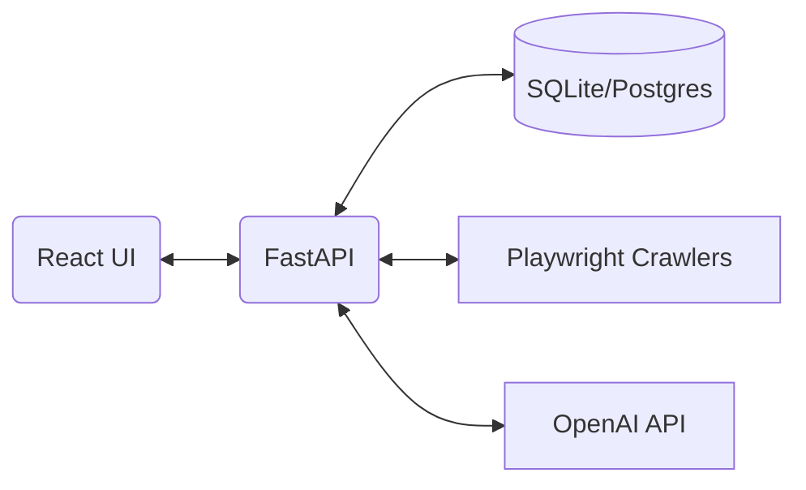

<div align="center">

# 🌍 AI-Agent Travel Planner 🧭

**A local-first, real-time, multi-agent travel intelligence system (India-first)**

[](https://fastapi.tiangolo.com/)
[](https://reactjs.org/)
[](https://playwright.dev/)
[](https://openai.com/)

[Features](#-features) • [Architecture](#%EF%B8%8F-architecture) • [Getting Started](#-getting-started) • [Agents](#%EF%B8%8F-multi-agent-system)

---

<!-- Placeholder for Hero Video/Animation -->
> *<p align="center">🎥 [Insert Hero Video/GIF here demonstrating the app in action]</p>*

</div>

This project combines **live web scraping**, **cloud LLM agents**, and a **full-stack app** to help users plan trips, manage budgets and tasks, and generate communications.

We never perform payments or actual bookings — the system only redirects users to official booking sites based on its live scraped intelligence.

---

## ✨ Features

- **🏨 Live Hotel & Flight Search**: Real-time prices scraped directly from Booking.com and Indian travel sites via headless browsers (Playwright). No cached or fake numbers!
- **🤖 High-Performance AI**: Powered by OpenAI (ChatGPT-4o-mini). Intelligent, fast, and reliable reasoning capabilities.
- **🧠 Multi-Agent Reasoning**: Dedicated agents handle planning itineraries, validating budgets, managing tasks, and drafting communications.
- **🎨 Stunning Aesthetics**: A beautiful glassmorphism-themed, fully responsive React UI.
- **🔒 Privacy**: The app never makes unauthorized purchases or sends emails without explicit confirmation.
- **💾 Smart Caching & Audit Trails**: Maintains full records of decisions and data sources for transparency.

<!-- Placeholder for Main Feature Screenshot -->
> *<p align="center">📸 [Insert Dashboard/Itinerary Screenshot here]</p>*

## 💻 Tech Stack

- **Backend:** FastAPI, SQLModel, Playwright, Node.js (Express server.js)
- **Frontend:** React, Vite, Tailwind CSS v4
- **Database:** SQLite (async)

---

## 🏗️ Architecture

The application is structured to ensure agents reason over **structured data only** with no direct web access.



---

## 🚀 Getting Started

### Prerequisites

Ensure you have the following installed to run this project:
- **Git**
- **Node.js** (LTS Recommended)
- **Python 3.10+** 
- **Playwright** (For scraping)
- **OpenAI API Key** (Set up via `.env` file)

### Local Quickstart

1. **Clone the repository**
   ```bash
   git clone https://github.com/N0madx86/ai-agent-travel-planner.git
   cd ai-agent-travel-planner
   ```

2. **Backend Setup (FastAPI)**
   ```bash
   cd backend
   python -m venv venv
   # Activate: `venv\Scripts\activate` on Windows, `source venv/bin/activate` on Mac/Linux
   pip install -r requirements.txt
   playwright install chromium
   python -m uvicorn app.main:app --reload
   ```

3. **Frontend Setup (React/Vite)**
   ```bash
   cd frontend
   npm install
   npm run dev
   ```
   Visit `http://localhost:5173` to explore the app!

4. **Environment Configuration**
   Ensure your OpenAI API key is configured correctly in the backend `.env` file to empower the intelligence layer.

<!-- Placeholder for Setup/Installation GIF -->
> *<p align="center">🎥 [Insert Setup/Terminal GIF here (Optional)]</p>*

---

## 🕵️ Multi-Agent System

Our AI ecosystem is divided into specific roles to ensure targeted and efficient reasoning over the structured output provided by our backend:

- 📝 **Planner Agent**: Consumes structured offers and builds smart itineraries.
- 💰 **Budget Agent**: Evaluates feasibility vs. user budgets and suggests cheaper alternatives.
- ✅ **Task Agent**: Constructs contextual to-do items and reminders.
- ✉️ **Communication Agent**: Drafts emails and calendar events (requires your confirmation!).

---

## 🤝 Contributing

Contributions are welcome! Be respectful to the scraped targets by using rate-limits and polite crawling patterns.

1. Fork the repo
2. Create your feature branch (`git checkout -b feature/AmazingFeature`)
3. Commit your changes (`git commit -m 'Add some AmazingFeature'`)
4. Push to the branch (`git push origin feature/AmazingFeature`)
5. Open a Pull Request

---

## 📜 Authors & Acknowledgments

- **Maintainer**: [@N0madx86](https://github.com/N0madx86)
- **Design Inspiration**: Built as a portfolio-grade multi-agent showcase.
